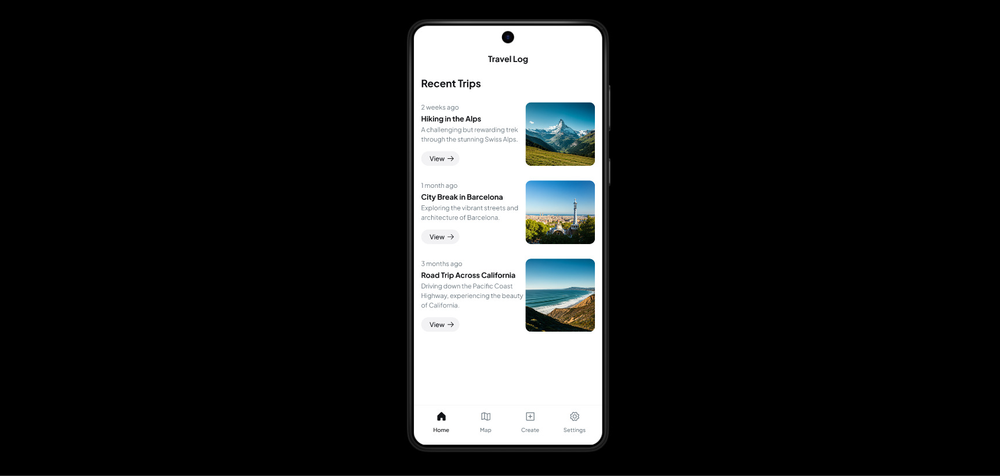
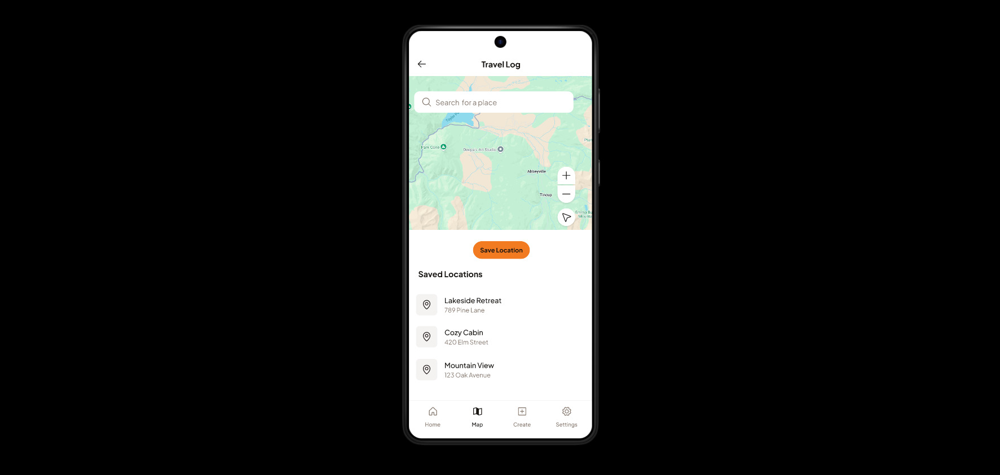

# Travel Log

Travel Log, gezdiğiniz yerleri harita üzerinde işaretleyip, gezilerinizle ilgili notlar almanıza yardımcı olan bir uygulamadır.

## Özellikler
- Kullanıcıların ziyaret ettikleri yerleri harita üzerinde kaydetmelerine olanak sağlar.
- Kullanıcılar, konum bilgilerini ekleyebilir ve notlar bırakabilirler.
- Firebase entegrasyonu ile veriler güvenli bir şekilde saklanır.

## Teknolojiler

- **Flutter**
- **Firebase**
- **Flutter Map**
- **Dart**

## Uygulamanın Ekran Görüntüleri 
 
 

 ##Lisans
Bu proje MIT Lisansı altında lisanslanmıştır.

## İletişim

Ad Soyad: Tuba Nur Ünlü  
Email: tuba.unlu.011@gmail.com  
GitHub: [https://github.com/tubaunlu](https://github.com/tubaunlu)

# Travel Log

Travel Log is an app that helps you mark places you've visited on a map and take notes about your trips.

## Features
- Allows users to record places they've visited on a map.
- Users can add location information and leave notes.
- Data is securely stored with Firebase integration.

## Technologies

- **Flutter**
- **Firebase**
- **Flutter Map**
- **Dart**

## Application Screenshots

##License
This project is licensed under the MIT License.

## Contact

Full Name: Tuba Nur Ünlü  
Email: tuba.unlu.011@gmail.com  
GitHub: [https://github.com/tubaunlu](https://github.com/tubaunlu)
